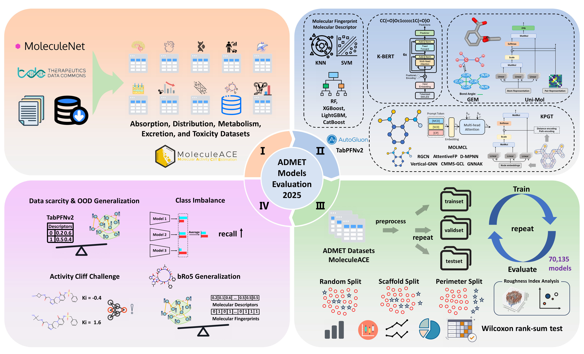

# **A Comprehensive Benchmark of ADMET Predictors in the Era of Foundation Models**

<figure style="text-align: center; margin: 20px 0;">
    
    <figcaption style="font-weight: bold; text-align: center; margin-top: 15px; font-size: 1.1em;">
        <strong>Protocol for the systematic evaluation of ADMET models</strong>
    </figcaption>
</figure>

## 🧪 **Datasets Assembling and Preprocessing**

In order to evaluate the potential of various drug efficacy prediction models in practical applications, in this project, we integrated multiple publicly available datasets covering key ADMET (absorption, distribution, metabolism, excretion, and toxicity) prediction endpoints.

Our data processing pipeline involves two key stages: **(1) Data Curation** and **(2) Strategic Data Splitting**.

---

### 1. Datasets Used

We selected a diverse set of datasets to ensure our benchmark is comprehensive. All datasets are provided in the [`data/`](./data/) directory and have been meticulously cleaned, standardized, and deduplicated.

The primary datasets used in this study are summarized below:

| Dataset Name              | Class   | Data Size         | Source / Reference                               |
| ------------------------------ | ---------- | ----------- | ------------------------------------------------ |
| **BBBP** | absorption     | 3873  | `https://doi.org/10.1093/nar/gkab255` `https://doi.org/10.1039/c7sc02664a` `https://doi.org/10.1093/bioinformatics/btaa918`|
| **hERG** | toxicity   | 9673  | `https://doi.org/10.1038/s41467-023-38192-3`     |
| **Mutagenicity** | toxicity                    | 8779    | `https://doi.org/10.1093/nar/gkab255`  `https://doi.org/10.1021/acs.jmedchem.1c00421`                           |
| **Oral Bioavailability** | absorption                    | 1444    | `https://doi.org/10.1021/acs.jcim.3c00554`                             |
| **HLM Metabolic Stability** | metabolism                    | 5860    | `https://doi.org/10.1093/bioinformatics/btad503`                             |
| **Caco2 Permeability** | absorption                    | 842    | `https://doi.org/10.48550/arXiv.2102.09548`                             |
| **HalfLife** | excretion                    | 1314    | `https://doi.org/10.48550/arXiv.2102.09548`                             |
| **VDss** | distribution                    | 1092    | `https://doi.org/10.48550/arXiv.2102.09548`                             |
| **Tox21 NR ER** | toxicity                    | 5964    | `https://doi.org/10.1039/c7sc02664a`                             |
| **Cycpept PAMPA** | absorption                    | 6637    | `https://pubs.acs.org/doi/10.1021/acs.jcim.2c01573`                             |

Please refer to [`data/dataprocessor.py`](data/dataprocessor.py) for the data cleaning and merging process of these datasets.

### 2. Data Splitting Strategies

A critical aspect of evaluating model generalization is the data splitting strategy. To rigorously test the models and simulate real-world scenarios where models must predict on novel chemical matter, we employed several splitting methods beyond a simple random split.

Our splitting strategies include:

* **Random Split**: The standard, baseline approach where data is partitioned randomly. This tests a model's general interpolation ability.

* **Scaffold Split**: This method separates molecules based on their core chemical structure (scaffold). All molecules sharing the same scaffold are placed in the same set (either train or test). This is crucial for testing a model's ability to **generalize to new chemical scaffolds**, which is a more realistic and challenging task.

* **Perimeter Split**: To further stress-test the models, we used the advanced splitter proposed by **Tossou et al. (2024)** in their work on **Real-World Molecular Out-Of-Distribution: Specification and Investigation**. The method creates scene where the test set is intentionally dissimilar from the training set, thereby testing the model's **extrapolation capabilities**.

The implementation for these splitting methods can be found in the [`data/datasplitting.py`](data/datasplitting.py) file. This multi-faceted approach ensures a thorough and robust comparison of the different ADMET predictors.

## 🧪 **ADMET Predictors Evaluation**
---

## 🧪 **Roughness Index Application**
---
